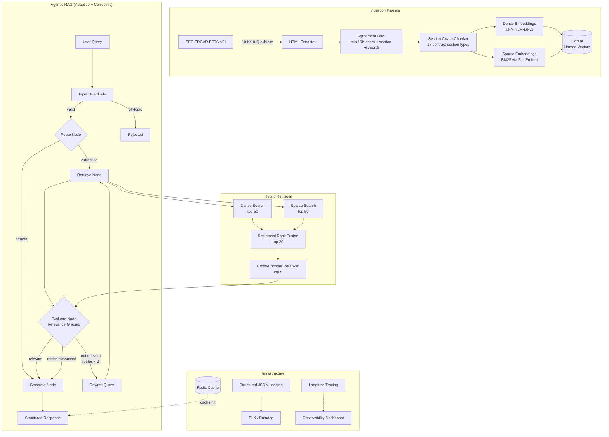

# SEC RAG

Production-grade retrieval-augmented generation system for analyzing employment contracts from SEC EDGAR filings. Ingests real regulatory filings, indexes them with hybrid search, and extracts structured contractual obligations using a self-correcting LangGraph agent.

Built with FastAPI, LangGraph, Qdrant, and Claude. Dockerized with Redis caching, structured logging, and LLM-as-judge evaluation.

## Architecture



## What This Does

Given a natural-language question about employment contracts ("What are the non-compete obligations?"), the system:

1. **Searches** a vector database of real SEC EDGAR employment agreements using hybrid retrieval (dense + sparse + fusion + reranking)
2. **Evaluates** whether the retrieved documents are relevant — if not, rewrites the query and retries (Corrective RAG)
3. **Extracts** structured `Obligation` objects with typed fields (party, conditions, citations) grounded in the source text
4. **Returns** a JSON response with obligations, confidence score, and verbatim citations linked back to specific contract sections

## Key Features

| Category | Details |
|----------|---------|
| **Retrieval** | Hybrid search (dense + sparse + RRF fusion), cross-encoder reranking, section-type filtering |
| **Agent** | LangGraph state machine with adaptive routing, CRAG self-correction loop (up to 2 retries), structured output extraction |
| **Data** | Real SEC EDGAR filings — 17 contract section types (compensation, termination, non-compete, equity, etc.) |
| **Caching** | Redis query cache with SHA-256 key normalization, TTL expiry, graceful degradation when Redis is down |
| **Logging** | Structured JSON logging (structlog) with request ID correlation across all components |
| **Evaluation** | LLM-as-judge metrics via ragas (faithfulness, answer relevancy, answer correctness) + aggregate pipeline metrics |
| **Security** | API key auth (HMAC timing-safe), rate limiting (per-IP, proxy-aware), body size limits, prompt injection guards, concurrency semaphore, request timeouts, non-root Docker container |
| **Observability** | Prometheus metrics (cache hits, timeouts, latency), Langfuse tracing, structured JSON logging with request ID correlation, health endpoint |

## Tech Stack

| Component | Technology |
|-----------|------------|
| Agent orchestration | LangGraph (StateGraph) |
| LLM | Claude (Anthropic) / GPT (OpenAI) via LangChain |
| Dense embeddings | sentence-transformers (all-MiniLM-L6-v2, 384-dim) |
| Sparse embeddings | FastEmbed BM25 (Qdrant/bm25) |
| Reranker | cross-encoder/ms-marco-MiniLM-L6-v2 |
| Vector database | Qdrant (dual named vectors: dense + sparse) |
| Cache | Redis with hiredis |
| API framework | FastAPI |
| Logging | structlog (JSON + console renderers) |
| Observability | Prometheus (metrics) + Langfuse (tracing) |
| Data source | SEC EDGAR EFTS API |
| Frontend | Streamlit |
| Containerization | Docker (multi-stage, pre-baked ML models) |

## Quick Start

### Docker (recommended)

```bash
# 1. Clone and configure
git clone <repo-url>
cd sec-rag
cp .env.example .env
# Edit .env — set SEC_RAG_ANTHROPIC_API_KEY (required)
# The docker-compose.override.yml provides dev defaults for REDIS_PASSWORD
# and SEC_RAG_API_KEY. For production, set these in .env as well.

# 2. Start everything (API + Qdrant + Redis)
docker compose up -d
# First build takes ~4 min (downloads ML models into the image)

# 3. Ingest contracts from SEC EDGAR
docker compose exec app python scripts/ingest.py --max-results 50

# 4. Verify
curl http://localhost:8000/health
```

### Local Development

```bash
# 1. Start infrastructure
docker compose up -d qdrant redis

# 2. Install Python dependencies
python -m venv .venv && source .venv/bin/activate
pip install -e ".[dev]"

# 3. Configure
cp .env.example .env
# Edit .env — set SEC_RAG_ANTHROPIC_API_KEY

# 4. Ingest data
python scripts/ingest.py --max-results 50

# 5. Start the API
uvicorn sec_rag.api.main:app --host 127.0.0.1 --port 8000

# 6. (Optional) Streamlit UI
pip install -e ".[frontend]"
streamlit run src/sec_rag/frontend/app.py
```

### Query the API

```bash
curl -X POST http://localhost:8000/query \
  -H "Content-Type: application/json" \
  -H "X-API-Key: dev-key-not-for-production" \
  -d '{"query": "What are the non-compete obligations in employment contracts?"}'
```

Response:
```json
{
  "success": true,
  "result": {
    "obligations": [
      {
        "obligation_type": "non-compete",
        "party": "employee",
        "description": "Employee shall not engage in competing business...",
        "conditions": "For 12 months following termination",
        "citations": [
          {
            "chunk_id": "...",
            "company_name": "ACME Corp",
            "section_type": "non_compete",
            "excerpt": "...verbatim text from the contract..."
          }
        ]
      }
    ],
    "summary": "...",
    "confidence": 0.92,
    "source_count": 5
  },
  "cached": false
}
```

## Evaluation

The evaluation harness tests the full pipeline against a golden set of 20 questions covering all major contract clause types.

```bash
# Basic metrics (response rate, confidence, citation rate, latency)
# Set SEC_RAG_API_KEY to match the API's configured key
SEC_RAG_API_KEY=dev-key-not-for-production python scripts/evaluate.py

# With LLM-as-judge metrics (requires API key for the judge LLM)
pip install -e ".[eval]"
SEC_RAG_API_KEY=dev-key-not-for-production python scripts/evaluate.py --with-ragas
```

### Metrics

| Metric | Type | Description |
|--------|------|-------------|
| Response rate | Aggregate | Fraction of queries returning at least one extracted obligation |
| Average confidence | Aggregate | Mean self-assessed confidence score |
| Citation rate | Aggregate | Fraction of obligations backed by source citations |
| Section coverage | Aggregate | Contract section types appearing in citations |
| Average latency | Aggregate | Mean end-to-end response time |
| **Faithfulness** | LLM-judge (ragas) | Is the answer grounded in the retrieved context? |
| **Answer relevancy** | LLM-judge (ragas) | Is the answer relevant to the question? |
| **Answer correctness** | LLM-judge (ragas) | How close is the answer to the ground truth? |

## Project Structure

```
src/sec_rag/
    config.py                   # Pydantic settings (all config via SEC_RAG_* env vars)
    cache.py                    # Redis query cache with graceful degradation
    embedding.py                # Dense (sentence-transformers) + sparse (FastEmbed BM25)
    models/
        documents.py            # SectionType (17 types), Chunk, ChunkMetadata
        analysis.py             # Obligation, Citation, AnalysisResult
        retrieval.py            # ScoredChunk, RetrievalResult
        state.py                # QueryState (LangGraph TypedDict)
    ingestion/
        keywords.py             # Canonical keyword-to-section mapping (shared by chunker + filter)
        edgar_client.py         # SEC EDGAR EFTS search + exhibit download
        html_extractor.py       # HTML-to-text (BeautifulSoup + lxml)
        filter.py               # Full agreement vs. amendment classification
        chunker.py              # Section-aware chunking (17 section types)
        indexer.py              # Qdrant collection lifecycle + upsert
    retrieval/
        hybrid_search.py        # Parallel dense + sparse queries with RRF
        reranker.py             # Cross-encoder reranking
        pipeline.py             # RetrievalPipeline orchestrator
    agent/
        graph.py                # LangGraph StateGraph construction
        nodes.py                # Node functions (route, retrieve, evaluate, generate, rewrite)
        prompts.py              # System prompts for each node
        guardrails.py           # Input validation + off-topic detection
        llm.py                  # Provider-agnostic LLM factory
    observability/
        logging.py              # Structured logging (structlog + contextvars)
        langfuse_setup.py       # Langfuse callback handler
    api/
        main.py                 # FastAPI app, lifespan DI, middleware
        routes.py               # /query and /health endpoints
        schemas.py              # Request/response Pydantic models
    frontend/
        app.py                  # Streamlit UI
scripts/
    ingest.py                   # CLI ingestion pipeline
    evaluate.py                 # Evaluation harness (basic + ragas metrics)
eval/
    golden_set.json             # 20 curated test questions with ground truth
tests/                          # 267 tests (pytest)
Dockerfile                      # Multi-stage build, pre-baked ML models, non-root user
docker-compose.yml              # 3 services: app + qdrant + redis
```

## How It Works

### 1. Ingestion

`scripts/ingest.py` searches SEC EDGAR for 10-K/10-Q exhibits containing employment agreements, downloads the HTML, extracts clean text, filters out amendments (minimum 10K characters + section keyword matching), chunks by contract section type, generates dual embeddings (dense + sparse), and upserts into Qdrant with named vectors and payload indexes.

### 2. Query Processing

When a query arrives at `/query`:
- **Guardrails** reject off-topic queries before the pipeline runs
- **Cache check** — if Redis is available and the query was seen before, return the cached response instantly
- **Routing** — the LangGraph agent classifies the query as extraction (needs retrieval) or general (direct answer)
- **Retrieval** — parallel dense and sparse searches, fused with RRF, reranked by cross-encoder
- **Evaluation** — CRAG-style relevance grading; if documents aren't relevant, rewrite the query and retry (up to 2 retries)
- **Generation** — extract structured Obligation objects with typed fields and verbatim citations
- **Cache write** — successful responses are cached in Redis (background task, doesn't block response)

### 3. Evaluation

The eval harness queries the live API with golden-set questions and computes both aggregate metrics (response rate, citation rate, latency) and LLM-as-judge metrics via ragas (faithfulness, answer relevancy, answer correctness).

## Configuration

All configuration is via environment variables with the `SEC_RAG_` prefix. See [`.env.example`](.env.example) for the full list with descriptions. Only `SEC_RAG_ANTHROPIC_API_KEY` is required — everything else has sensible defaults.

## Known Limitations

- **Rate limiter is in-memory** — per-process, resets on restart. For horizontal scaling behind a load balancer, this should be replaced with a Redis-backed sliding window so rate limits are shared across instances.
- **Single-instance architecture** — the API runs as a single uvicorn process. For high-throughput production use, add a process manager (gunicorn) and horizontal scaling.
- **Ingestion is a one-shot script** — not a scheduled pipeline. For continuous ingestion of new filings, wrap in a cron job or task scheduler.

## Testing

```bash
# Full test suite (267 tests)
python -m pytest tests/ -x -q

# Lint
python -m ruff check src/ scripts/ tests/
```

## License

MIT
